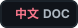

<table>
  <tr>
    <td width="104">
      
    </td>
    <td>
      <h1>Flovera</h1>
      <p>Android-local workspace agent for creating and previewing small demos on your phone.</p>
      <p>
        <a href="README.zh-CN.md"></a>
        <a href="LICENSE"></a>
        
        
        
      </p>
    </td>
  </tr>
</table>

Flovera is a local Android workspace for building small, phone-first demos with
an agent.

The app gives the agent a scoped workspace on your phone, keeps the conversation
and files together, and opens generated HTML/web artifacts in Android WebView.
The first public version, **Flovera Preview**, focuses on a fast loop: describe
an idea, let the agent create the files, inspect the result, then revise it in
the same place.

<table>
  <tr>
    <td width="50%" align="center">
      
      <br>
      <sub>English workflow preview</sub>
    </td>
    <td width="50%" align="center">
      
      <br>
      <sub>中文工作流预览</sub>
    </td>
  </tr>
</table>

## What You Can Build

- Mobile-first HTML demos that open directly in Android WebView.
- Small games, dashboards, calculators, reports, and interactive prototypes.
- Local workspace artifacts such as Markdown, JSON, CSV, text, code, images,
  and PDFs.
- Python-generated outputs for scripting, calculation, and structured file
  generation.

## How It Works

1. Open Flovera on Android.
2. Ask the agent to create a small artifact.
3. The agent reads, writes, searches, and edits files inside the scoped
   workspace.
4. Flovera validates generated app manifests and preview targets.
5. Open the result in the app WebView or supported file preview.
6. Continue the conversation to revise the artifact.

The intended loop is:

```text
chat -> workspace files -> diagnostics -> WebView preview -> revision
```

## Current Preview Capabilities

- Persistent sessions and conversation history.
- Chronological conversation rendering with compact tool and status events.
- Workspace file read, write, edit, list, and search tools.
- Workspace snapshots for safer iteration.
- HTML/WebView preview and workspace-local HTTP preview.
- `flovera.app.json` manifests for generated workspace apps.
- `artifact_diagnose` checks for generated Flovera app registration.
- Controlled Python runtime for bounded local generation and verification.
- Preview support for HTML, Markdown, JSON, CSV, text, code, images, and PDFs.
- Configurable model providers stored in app settings, not source code.
- Network tools enabled by default, with settings controls.
- Brave Search support when a Brave Search API key is configured.

## Preview Notes

- Flovera Preview is tuned for small demos and local artifacts.
- Android background behavior still depends on OS and device vendor policy.
- Android WebView can differ from desktop browsers, so generated pages should be
  checked on-device.
- Provider API keys and app permissions live in Flovera app settings, not in the
  workspace source tree.
- DeepSeek is the primary tested provider for the first preview. OpenAI-style,
  Anthropic-style, and other provider routes are being expanded.
- MCP, Git, and broader shell-style workspace tooling are on the roadmap.

## Repository Layout

```text
.
|-- android/spike/                 Android app source
|-- docs/                          Project and release notes
|-- examples/                      Example material
|-- scripts/                       Repository scripts
|-- PRODUCT_QUALITY.md             Product quality model and internal backlog
|-- CHANGELOG.md                   User-facing change notes
|-- THIRD_PARTY_NOTICES.md         Dependency notice summary
`-- LICENSE                        MIT license
```

## Build

Requirements:

- Android Studio or Android SDK.
- JDK 17. Android Studio JBR is recommended on Windows.

From `android/spike`:

```powershell
$env:JAVA_HOME='C:\Program Files\Android\Android Studio\jbr'
$env:ANDROID_HOME=Join-Path $env:LOCALAPPDATA 'Android\Sdk'
$env:ANDROID_SDK_ROOT=$env:ANDROID_HOME
$env:PATH="$env:JAVA_HOME\bin;$env:ANDROID_HOME\platform-tools;$env:PATH"

.\gradlew.bat :app:assembleFloveraDebug :app:assembleFloveraDebugAndroidTest
```

## Device Verification

Use the protected verifier instead of uninstalling the app during verification.
Flovera app data, permissions, provider settings, and sessions are part of the
product state.

From `android/spike`:

```powershell
.\scripts\verify-flovera-android.ps1 -DeviceSerial <adb-serial> -SkipRelease
```

Use `-SkipDevice` for build-only verification.

The app currently has two Android package slots:

- `com.flovera.app` with launcher label `Flovera`
- `com.example.ailinuxvmspike` with launcher label `Flovera legacy`

The legacy slot exists so existing test devices can update an old install
without losing app data.

## Configuration And Secrets

Do not commit API keys, signing files, local paths, generated settings, APKs, or
workspace data.

Runtime provider settings are stored by the Android app. `.env.example` is only
a local development template.

## License

Flovera is licensed under the MIT License. See [LICENSE](LICENSE).

Flovera uses [JetBrains Koog](https://github.com/JetBrains/koog) as the upstream
agent runtime framework. Koog is licensed under the Apache License 2.0. See
[THIRD_PARTY_NOTICES.md](THIRD_PARTY_NOTICES.md) for dependency notes.
