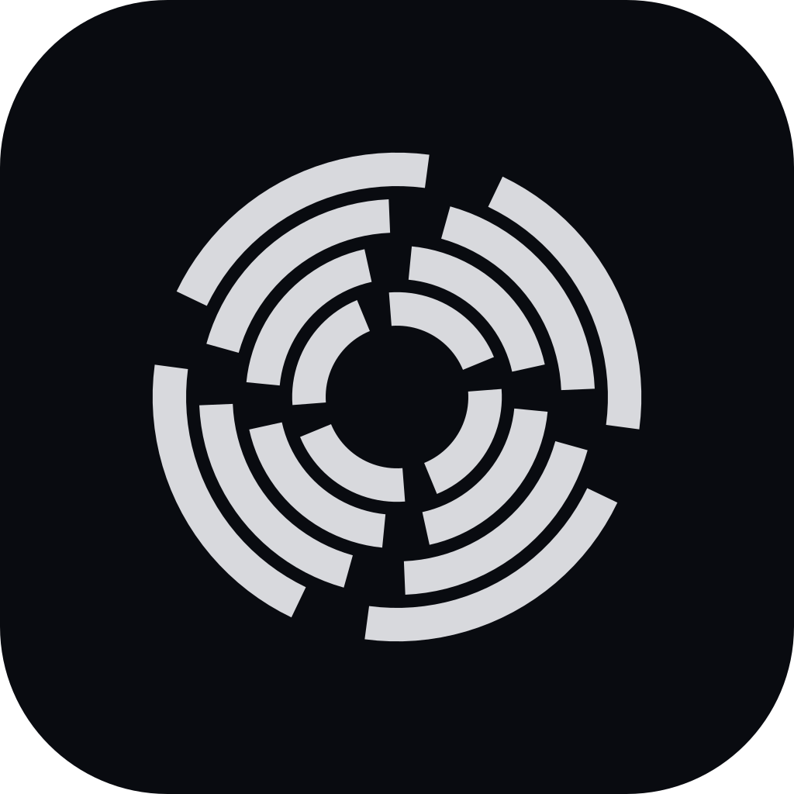
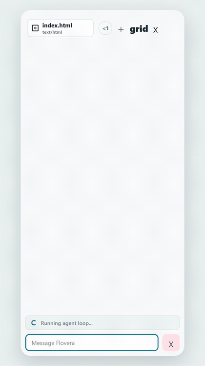
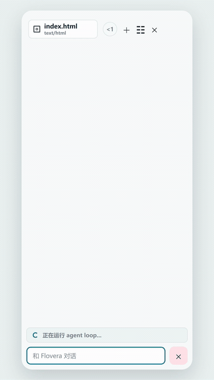

<table>
  <tr>
    <td width="104">
      
    </td>
    <td>
      <h1>Flovera</h1>
      <p>运行在 Android 上的轻量 agent 工作区，用来在手机上创造和预览小应用、文档和原型。</p>
      <p>
        <a href="README.md"></a>
        <a href="LICENSE"></a>
        
        
        
      </p>
    </td>
  </tr>
</table>

Flovera 是一个基于 Android 端的轻量 agent 工作区程序。

它会在手机上提供一个本地工作区。你可以和 agent 对话，让它创建和修改文件，并直接在应用里预览结果。当前的 **Flovera Preview** 重点放在一个短闭环上：提出想法，生成文件，查看结果，然后继续修改。

<table>
  <tr>
    <td width="50%" align="center">
      
      <br>
      <sub>English workflow preview</sub>
    </td>
    <td width="50%" align="center">
      
      <br>
      <sub>中文工作流预览</sub>
    </td>
  </tr>
</table>

## 可以用来做什么

- 自由创造属于自己的小应用。
- 把一个灵感初步实现成可运行的原型。
- 制作交互式 HTML 页面、工具、dashboard 和小游戏。
- 写文档、笔记、报告和 PPT 草稿。
- 生成并预览 Markdown、JSON、CSV、文本、代码、图片和 PDF 等工作区产物。
- 在需要脚本、计算或结构化文件生成时，使用受控 Python runtime 辅助完成。

## 工作方式

1. 在 Android 上打开 Flovera。
2. 告诉 agent 你想创建什么。
3. agent 在受控 workspace 内读取、写入、搜索和编辑文件。
4. Flovera 检查生成的 app manifest 和预览入口是否可用。
5. 在应用内预览结果。
6. 继续对话，让 agent 修改和完善产物。

核心循环是：

```text
对话 -> workspace 文件 -> 诊断 -> 应用内预览 -> 继续修改
```

## 当前 Preview 能力

- 持久化 session 和对话历史。
- 按时间顺序渲染对话，并用较轻量的形式展示工具和状态事件。
- workspace 文件读取、写入、编辑、列表和搜索工具。
- HTML 预览和 workspace-local HTTP 预览。
- 使用 `flovera.app.json` 描述生成的 workspace app。
- 使用 `artifact_diagnose` 检查生成的 Flovera app 是否成功注册。
- 受控 Python runtime，用于本地生成、计算和验证。
- 支持预览 HTML、Markdown、JSON、CSV、文本、代码、图片和 PDF。
- 可编辑的 workspace skills，用来扩展 agent 工作流，同时避免核心提示词过重。
- 用户管理的密钥入口，用来保存 API key 和服务 token。
- 可选的 workspace memory 和 todo 文件，用来记录稳定偏好、事实和短任务检查点。
- DeepSeek provider 配置保存在应用设置里，不写入源码。
- network 工具默认开启，并保留设置入口。
- 配置 Brave Search API key 后支持 Web Search。

## Preview 说明

- 当前 preview 主要针对 DeepSeek 的正常使用做测试和支持。
- Android 后台行为仍受系统和厂商策略影响。
- Android WebView 和桌面浏览器存在差异，生成页面应在设备上检查。
- provider API key 和应用权限属于 Flovera app 设置，不是 workspace 源码文件。
- MCP、Git 和更完整的 shell 风格 workspace 工具仍在后续规划中。

## 仓库结构

```text
.
|-- android/spike/                 Android app 源码
|-- docs/                          项目和发布文档
|-- examples/                      示例材料
|-- scripts/                       仓库脚本
|-- PRODUCT_QUALITY.md             产品质量模型和 backlog
|-- CHANGELOG.md                   用户可读的变更记录
|-- THIRD_PARTY_NOTICES.md         依赖说明
`-- LICENSE                        MIT license
```

## 构建

要求：

- Android Studio 或 Android SDK。
- JDK 17。Windows 上推荐使用 Android Studio 自带 JBR。

在 `android/spike` 下执行：

```powershell
$env:JAVA_HOME='C:\Program Files\Android\Android Studio\jbr'
$env:ANDROID_HOME=Join-Path $env:LOCALAPPDATA 'Android\Sdk'
$env:ANDROID_SDK_ROOT=$env:ANDROID_HOME
$env:PATH="$env:JAVA_HOME\bin;$env:ANDROID_HOME\platform-tools;$env:PATH"

.\gradlew.bat :app:assembleFloveraDebug :app:assembleFloveraDebugAndroidTest
```

## 真机验证

验证时使用受保护的 verifier，不要随意卸载已有 Flovera app。应用数据、权限、provider 设置和 session 本身都是产品状态的一部分。

在 `android/spike` 下执行：

```powershell
.\scripts\verify-flovera-android.ps1 -DeviceSerial <adb-serial> -SkipRelease
```

只做构建验证时使用 `-SkipDevice`。

应用目前有两个 Android 包名槽位：

- `com.flovera.app`，启动器名称 `Flovera`
- `com.example.ailinuxvmspike`，启动器名称 `Flovera legacy`

legacy 槽位用于让已有测试设备从旧包名更新，避免丢失 app 数据。

## 配置和密钥

不要提交 API key、签名文件、本地路径、生成的设置、APK 或 workspace 数据。

运行时 provider 配置由 Android app 保存。`.env.example` 只是本地开发模板。

## License

Flovera 使用 MIT License。详见 [LICENSE](LICENSE)。

Flovera 使用 [JetBrains Koog](https://github.com/JetBrains/koog) 作为上游 agent runtime framework。Koog 使用 Apache License 2.0。依赖说明见 [THIRD_PARTY_NOTICES.md](THIRD_PARTY_NOTICES.md)。
